# Soccer machine
## Q1. 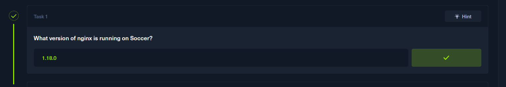
1. set soccer.htb in the hosts file using these commands:
   1. sudo nano /etc/hosts
   2. [IP]  soccer.htb
2. use nmap to find what services are working on the machine
   1. n

## Q2 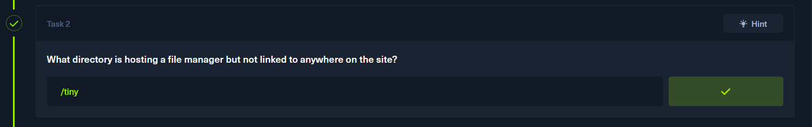
1. enumerate the machine to find the hidden folders
2. use good wordlist like Web-Content/directory-list-1.0.txt
   1. cd usr/share/wordlists/SecLists/Discovery [on kali linux, if not download it from any online resource]
   2.  gobuster dir -u http://soccer.htb -w Web-Content/directory-list-1.0.txt -t 50
   3.  you will find the tiny directory.

## Q3 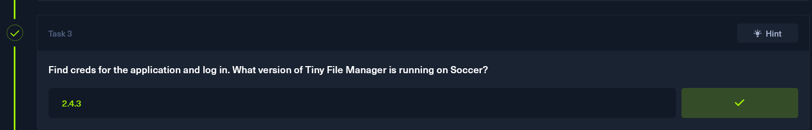
* search online for tiny filemanager
* you will find on a github repo that usually admins use admin as username, and admin@123 as the password, because this is the defualt cred
* 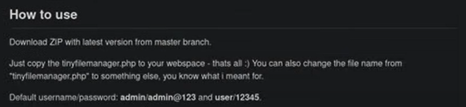
* then to know the version just open tiny folder, then **tinyfilemanager.php** you will see the version 
* 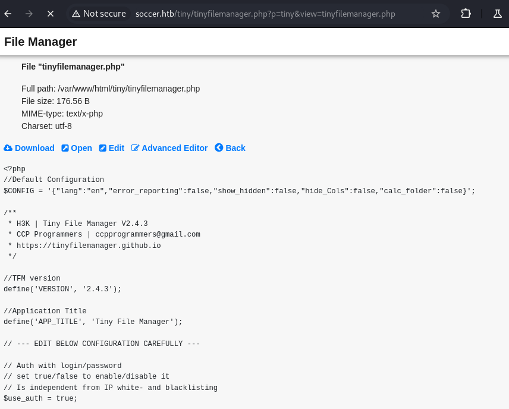

## Q4 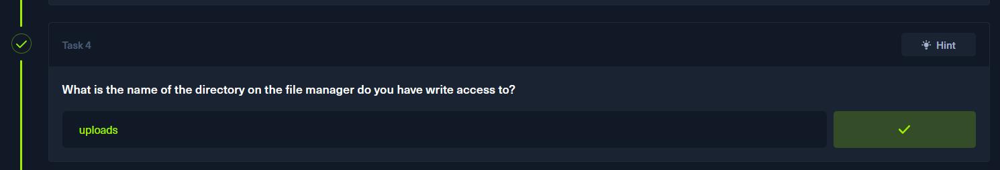
* on the **tinyfilemanager.php** you will see an icon saying **copy to** click on it, you will find the uploads folder, so this mean that we have write permissions on it.

## Getting reverse shell
* Since we have write permissions we can upload a reverse shell using the file manager
* 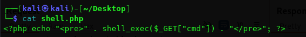
* then open nc listener
  * nc -lvnp 1313
* then using burp suite we can send the request like this:
* 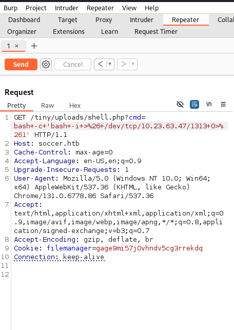 
* do not forget to encode the payload to url encoding
* then you should get a terminal like this: 
  * 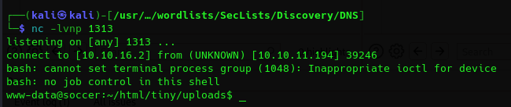

## Q5 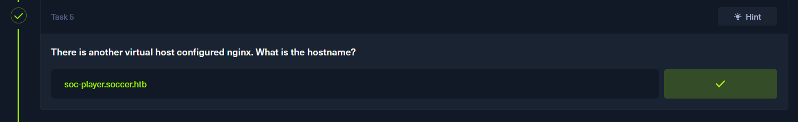
* To know the virtual host name we need to open the nginx folder
* so navigate to the root
  
    > cd ../../../../../

    > cd /etc/nginx/sites-available/

    > ls
    * you should see the following: 
    * 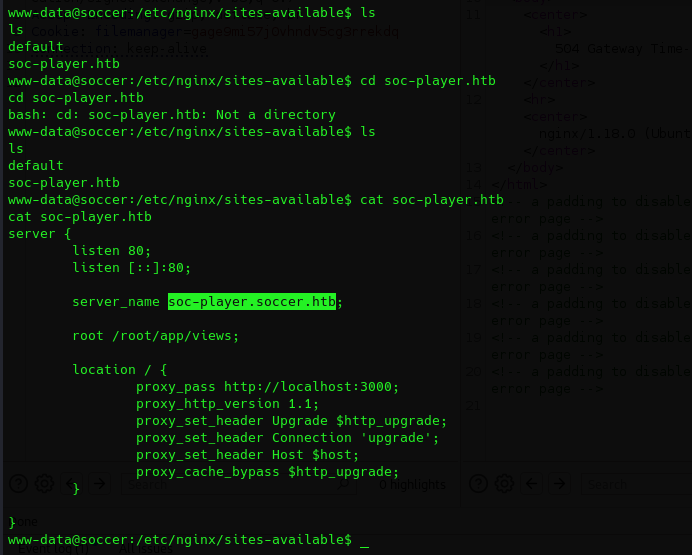