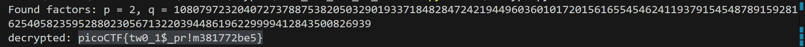

# Even RSA can be broken

| **Author** | **Date** | **Description** |
|------------|----------|--------------|
| Abdelaziz Neamatallah | 06.08.25 | Solution for Even_RSA_can_be_broken problem |

* The problem provides us with RSA code to encrypt certain flag, and on running the server, it will give you the used N, e, and the encrypted flag
* The Task is to decrypt this flag.

## Analyzing the given code
``` python
from sys import exit
from Crypto.Util.number import bytes_to_long, inverse
from setup import get_primes

e = 65537

def gen_key(k):
    """
    Generates RSA key with k bits
    """
    p,q = get_primes(k//2)
    N = p*q
    d = inverse(e, (p-1)*(q-1))

    return ((N,e), d)

def encrypt(pubkey, m):
    N,e = pubkey
    return pow(bytes_to_long(m.encode('utf-8')), e, N)

def main(flag):
    pubkey, _privkey = gen_key(1024)
    encrypted = encrypt(pubkey, flag) 
    return (pubkey[0], encrypted)

if __name__ == "__main__":
    flag = open('flag.txt', 'r').read()
    flag = flag.strip() # remove starting and trailing whitespace
    N, cypher  = main(flag)
    print("N:", N)
    print("e:", e)
    print("cyphertext:", cypher)
    exit()

```
* They use constant exponent e = 65537
* Then they read the flag from file on the server
* then they remove any leading or trailing whitespaces using the method *strip()*
* then there are 3 main functions
  1. gen_key(k):
     * it takes a constant integer, and generate two prime numbers less than integer / 2 -> r, q
     * then it computes N = p * q
     * then it computes phi(N) = (p - 1) * ( q - 1)
     * then it computes d which is the inverse of e mod N using Extended Eucliedan algortihm called *inverse()*
     * then it returns the public key (N, e), and private key d
  2. encrypt
     * just perform the encryption using RSA algorithm
     1. convert the text into integers, then into bytes using the method *encode('utf-8')*
     2. apply rsa equation -> c = m^e mod N     
  3. main
     * This is the main function which computes the keys, then encrypt the message, then returns the encrypted flag along with the public key.

## Solution steps
1. All we need to do is to first factorize N
2. then compute the private key
3. then decrypt the flag

``` python
possible_primes = [2, 3, 5, 7, 11, 13, 17, 19, 23, 29, 31, 37, 41, 43, 47, 53, 59, 61, 67, 71, 73, 79, 83, 89, 97, 101, 103, 107, 109, 113, 127, 131, 137, 139, 149, 151, 157, 163, 167, 173, 179, 181, 191, 193, 197, 199, 211, 223, 227, 229, 233, 239, 241, 251, 257, 263, 269, 271, 277, 281, 283, 293, 307, 311, 313, 317, 331, 337, 347, 349, 353, 359, 367, 373, 379, 383, 389, 397, 401, 409, 419, 421, 431, 433, 439, 443, 449, 457, 461, 463, 467, 479, 487, 491, 499, 503, 509]

# RSA public exponent (same as in encrypt.py)
e = 65537

N = 21615944640814547577507641006580386743696569448438899207202034403123310909248238758309097578318563250811647190576046113426440788972392459998825687001653878
ciphertext = 3531689653311876791070118231112421775350494072039337682177189742487672623755931063411998957923478398999526816470695036009721358599553334772417249332231929

for i in possible_primes:
    if N % i == 0:
        p = i
        q = N // p
        print(f"Found factors: p = {p}, q = {q}")
        break


# implementing extended eucliedean algorithm

def inverse(x, y):
    """
    Computes the modular inverse of x modulo y using extended Euclidean algorithm
    Returns x^(-1) mod y
    """
    def extended_gcd(a, b):
        if a == 0:
            return b, 0, 1
        
        gcd, x1, y1 = extended_gcd(b % a, a)
        x = y1 - (b // a) * x1
        y = x1
        
        return gcd, x, y
    
    gcd, x_coeff, y_coeff = extended_gcd(x % y, y)
    
    if gcd != 1:
        raise ValueError("Modular inverse does not exist")
    
    # Make sure the result is positive
    return (x_coeff % y + y) % y

def gen_key(p,q):
    """
    Generates RSA key with k bits
    """
    N = p*q
    d = inverse(e, (p-1)*(q-1))

    return ((N,e), d)


def decrypt(d,N, ciphertext):
    decrypted_int =  pow(ciphertext, d, N)
    # Convert integer back to bytes, then decode to string
    byte_length = (decrypted_int.bit_length() + 7) // 8
    decrypted_bytes = decrypted_int.to_bytes(byte_length, 'big')
    return decrypted_bytes.decode('utf-8') # Convert integer back to bytes, then decode to string
    

pubkey, d = gen_key(p, q)
decrypted = decrypt(d, N, ciphertext)

print('decrypted:', decrypted)

```
1. Generate a list of all possible prime numbers less than 1024 / 2
2. define N,e,ciphertext as global variables
3. factorize N, by iterating over all possible factors, and try to divide N by each candidate, if the remainder was 0, then this is a factor.
4. generate the key using *gen_key* sending the found factors p, q, and perform the same logic exactly, but here, we will need to implement extended eucliedan algorithm our self
5. EEC consists of 2 main methods: computing gcd, and computing EEC itself
   1. we use a recursive method, which accepts a, b
   2. if remainder is finally 0, we just return b, 0, and 1
   3. in each iteration we send again b % a, and a
   4. so in each iteration we compute the gcd between the remainder of dividing b by a, and a, which make the computation much faster than using the naive subtraction method.
   5. then we compute the coffiecents in order to create the linear equation in terms of the computed x1, y1
   6. then we return the gcd, and the two coefficents.
6. Then we perform the decryption using the equation m = c ^ d mon N
   1. but here notice that, since we used .encode which convert strings to bytes then to integers, 
   2. we need to reverse the order, convert the integers to bytes, then to strings
   3. so after we compute the equation, we will have integer, so we need to convert it to bytes level using 
      1. >  byte_length = (decrypted_int.bit_length() + 7) // 8
    decrypted_bytes = decrypted_int.to_bytes(byte_length, 'big')
    4. then we can now get the string from these bytes by decoding it in form of utf-8 

> Done :)
    