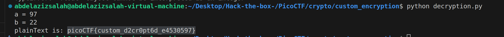

# Custom Encryption PICOCTF medium Crypto problem

| **Author** | **Date** | **Description** |
|------------|----------|--------------|
| Abdelaziz Neamatallah | 04.08.25 | Solution for custom_encryption problem |

* This task is about crypto.
* We are given encryption method, and encrypted text, and we are asked to decrypt the text, and extract the flag.
* So the main idea is to be able to understand the encryption algorithm, in order to be able to write python code to decrypt the text. 

## Understanding the Code
```python
from random import randint
import sys


# g^x mod p
def generator(g, x, p):
    return pow(g, x) % p


def encrypt(plaintext, key):
    '''
        This function is responsible to encrypt the plaintext
        c = alphabetic order of char * key * 311
        order is the Ascii value of the character -> ord('a') = 97, ord('A') = 65
    '''
    cipher = []
    for char in plaintext:
        cipher.append(((ord(char) * key*311)))
    return cipher


# this function check if the given number is prime or not.
def is_prime(p):
    v = 0
    for i in range(2, p + 1):
        if p % i == 0:
            v = v + 1
    if v > 1:
        return False
    else:
        return True


def dynamic_xor_encrypt(plaintext, text_key):
    cipher_text = ""
    key_length = len(text_key)
    # iterate through each character in the plaintext in reverse order
    # and XOR it with the corresponding character in the key
    # if the key is shorter than the plaintext, it will repeat
    # the key until it matches the length of the plaintext
    for i, char in enumerate(plaintext[::-1]):
        key_char = text_key[i % key_length]
        encrypted_char = chr(ord(char) ^ ord(key_char))
        cipher_text += encrypted_char
    return cipher_text


def test(plain_text, text_key):
    p = 97
    g = 31
    if not is_prime(p) and not is_prime(g):
        print("Enter prime numbers")
        return
    a = randint(p-10, p)
    b = randint(g-10, g)
    print(f"a = {a}")
    print(f"b = {b}")
    u = generator(g, a, p)
    v = generator(g, b, p)
    key = generator(v, a, p)
    b_key = generator(u, b, p)
    shared_key = None
    if key == b_key:
        shared_key = key
    else:
        print("Invalid key")
        return
    semi_cipher = dynamic_xor_encrypt(plain_text, text_key)
    cipher = encrypt(semi_cipher, shared_key)
    print(f'cipher is: {cipher}')


if __name__ == "__main__":
    message = sys.argv[1]
    test(message, "trudeau")

```
* The code consists of 5 main functions 
    1. **generator** which takes as input 3 variables g,x,p and generates a number in this format g ^ x mod p
    2. **is_prime** simple boolean function which check whether the given input is prime number or not.
    3. **dynamic_xor** it is the first encryption method, it accepts 2 parameters which are plaintext, and text_key, this key is known to us which is 'trudeau', then it reverse the input plaintext, then for each character, it gets its ASCII representation, then it gets the corresponding index of the key, and also convert it to ASCII representation, then it xor the two values using bitwise Xor, then it gets the character representation of the result.
        * Note that they use mod key_length for the cases that the key_length is shorter than the length of the given plaintext, so that the key will wrap around and start from the first position again.
        * i.e. if keylength = 6, and we are at iteration 6, we will get the key char at index 0
    4. **encrypt** which is the second encryption method, it accepts 2 parameters which are the plaintext, and the key, then it convert each character in the plaintext into ASCII representation, then it multiply it with key value * 311
    5. **test** this acts as the main function, it accepts plaintext, and text_key
        * then they perform diffie-hellman algorithm to generate *shared_key*
        * then they call the dynamic_xor(plain_text, text_key) to generate semi_cipher
        * then they call encrypt(semi_cipher, shared_key) to generate the final cipher text 
* Summary
    1. Generate shared key using Diffie_Hellman
    2. call dynamic_xor to generate semi_cipher
    3. call encrypt to generate the final cipher
## Solution logical steps
* Now all what we need is to reverse the operations
* so our approach will be
    1. Generate shared key using Diffie_Hellman
    2. call decrypt to generate the semi_plain
    3. call reverse_dynamic_xor to generate plain

## Solution Code explaination
```python
from random import randint
import sys


# g^x mod p
def generator(g, x, p):
    return pow(g, x) % p


def decrypt(cipher_text, key):
    '''
        This function is responsible to encrypt the plaintext
        c = alphabetic order of char * key * 311
        order is the Ascii value of the character -> ord('a') = 97, ord('A') = 65
    '''
    semi_plaintext = []
    for char in cipher_text:
        semi_plaintext.append(chr(round(char / (key*311))))
    # print(f'semi_plaintext is: {semi_plaintext}')
    return "".join(semi_plaintext)


# this function check if the given number is prime or not.
def is_prime(p):
    v = 0
    for i in range(2, p + 1):
        if p % i == 0:
            v = v + 1
    if v > 1:
        return False
    else:
        return True


def reverse_dynamic_xor(cipher, text_key):
    plain_text = ""
    key_length = len(text_key)

    # notice that during the encryption, the string was reversed, so we need to process it as is, then reverse it at the end.
    for i, char in enumerate(cipher):
        key_char = text_key[i % key_length]
        encrypted_char = chr(ord(char) ^ ord(key_char))
        plain_text += encrypted_char
    return plain_text[::-1]

def Diffie_Hellman(a_plus,b_plus):
    p = 97
    g = 31
    if not is_prime(p) and not is_prime(g):
        print("Enter prime numbers")
        return -1
    # a = randint(p-10, p)
    # b = randint(g-10, g)
    a = a_plus
    b = b_plus
    print(f"a = {a}")
    print(f"b = {b}")
    u = generator(g, a, p)
    v = generator(g, b, p)
    key = generator(v, a, p)
    b_key = generator(u, b, p)
    shared_key = None
    if key == b_key:
        shared_key = key
    else:
        print("Invalid key")
        return -1
    return shared_key

def test(cipher_text, text_key):
    # for a in range (10):
    #     for b in range (10):
    shared_key = Diffie_Hellman(97,22)
    if shared_key == -1: return
    semi_plain_text = decrypt(cipher_text, shared_key)
    plain_text = reverse_dynamic_xor(semi_plain_text, text_key)

    print(f'plainText is: {plain_text}')


if __name__ == "__main__":
    message = [151146, 1158786, 1276344, 1360314, 1427490, 1377108, 1074816, 1074816, 386262, 705348, 0, 1393902, 352674, 83970, 1141992, 0, 369468, 1444284, 16794, 1041228, 403056, 453438, 100764, 100764, 285498, 100764, 436644, 856494, 537408, 822906, 436644, 117558, 201528, 285498]
    test(message, "trudeau")


```

* we will need to modify 2 functions only,  *encrypt* , and *dynamic_xor_encrypt*
1. generate the shared key using the values a,b provided in the given file (do not try to bruteforce it, but if you want to do, there are 10*10 possible combinations for a and b :)
2. call decrypt, all what it does is that it iterate over each number given in the cipher text, and divides it by (311 * key) , and takes the round, and then get the corresponding character of the result, then return the list of all semi_decrypted_text
    * Note that we can use integer division also 
    > semi_plaintext.append(chr(char // (key*311)))
3. then we call reverse_dynamic_xor, which iterate over the cipher text (notice that it was rotated, so we will proccess it as is, then rotate it before return), then xor the ASCII code of each letter with the corresponding key letter, then get its correct ASCII letter, then we reverse the text to get the final plaintext 

> Done :)