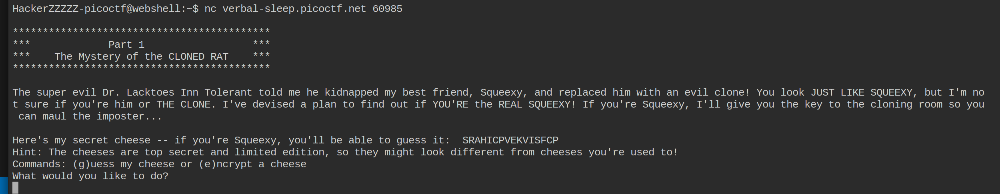
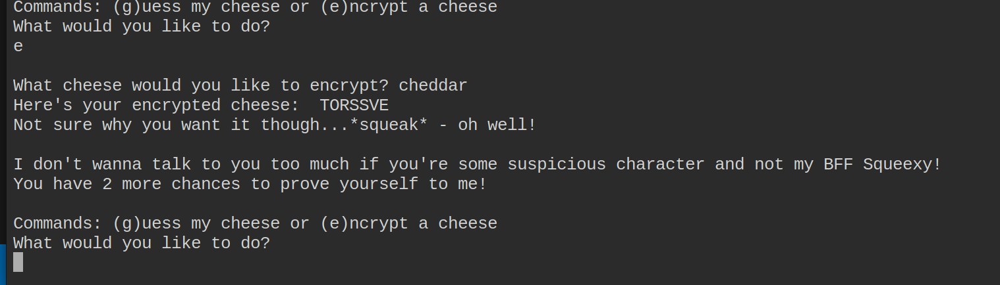
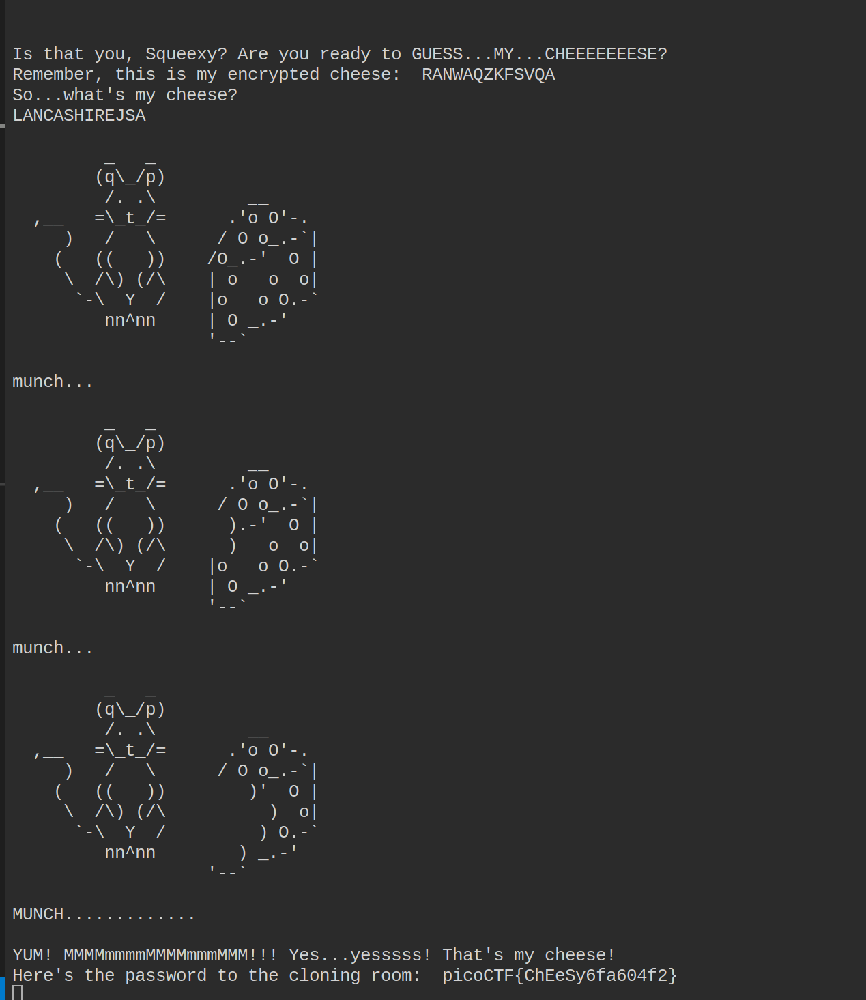

# Custom Guess my cheese PICOCTF medium Crypto problem

| **Author** | **Date** | **Description** |
|------------|----------|--------------|
| Abdelaziz Neamatallah | 06.08.25 | Solution for Guess my cheese problem |

1. This is a crypto problem
2. the task description is not so informative, so I lunched the webshell, and this what I got
   1. 
3. In the begining I thought that it is Caesar, so I went to **Cyberchef**, and applied bruteforce using rotation method, but I did not get something informative.
4. So, I tried the option e which allows encryption, then I was asked to add one cheese, so I added cheddar, so I got **TORSSVE**
   1. 
5. Then I thought about the affine cipher:
   1. c = a*m + b mod 26
6. so I applied the math on paper, we need 2 letters only to be able to compute the result
   1. T = C * a + b mod 26
   2. O = H * a + b mod 26
   3. R = E * a + b mod 26
   4. S = E * a + b mod 26
   5. S = D * a + b mod 26
   6. V = A * a + b mod 26
   7. E = R * a + b mod 26
7. so we can convert them to numbers -> A = 0, B = 1 ... Z = 25
   1. 19 = 2 * a + b mod 26
   2. 4 = 7 * a + b mod 26
   3. 21 = 4 * a + b mod 26
   4. 18 = 3 * a + b mod 26
   5. 18 = 3 * a + b mod 26
   6. 21 = 0 * a + b mod 26 => neglect this, because a here will not play a role
   7. 4 = 17 * a + b mod 26
8. we just need to pick any two equations so that the coefficent of a after subtraction should be coprime with 26 in order to be able to get the inverse for it. 
   1. 21 - 18 = (4-3) * a
   2. a = 3
   3. b => 21 = 4 * 3 + b => b = 9
   4. so a = 3, b = 9 can solve your task
9. now for each character in the affine perform this equation:
   1.  m = (c - b) * a^-1 => (c - 9) * 3^-1 mod 26
   2.  3^-1 mod 26 = 9
   3.  m = (c - 9) * 9 mod 26
   

## Getting the Flag
