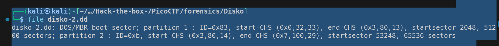
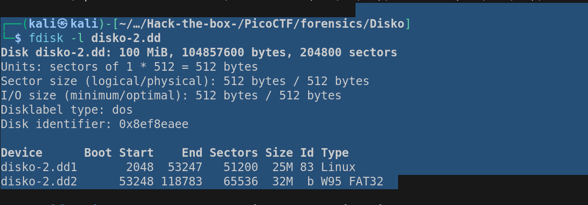

- Examining the file property
    > file disko-2.dd
    - 
    - dd files are byte to byte image of a disk or partition. 
    - This means that the available disk image contains 2 partitions
    - and the OS was DOS. 
    - the first partition ID=0x83 is an identifier refers to OS from type linux. 
    - start-CHS and end-CHS, in the past the hard was defined by cylendyr, head, and senor, so these values represent this parts. 
    - partition 1 starts from 2048, and it contains 51200 sectors, each of size 512 bytes. 
    - partition 2 starts from 53248, and contains 65536 sectors
- Since it contained multiple partitions, we should use fdisk to list available partitions within. 
    > fdisk -l disko-2.dd
    - 
    - fdisk is a disk partitioning tool, allows us to view, create, delete or modify disk partition on storage devices.
    - with -l, it lists to you all available partitions.
    - since the problem mentioned that we need to target the linux, so we should focus on the first partition. 
- Extracting the partition into .img format
    > dd if=disko-2.dd of=part1.img bs=512 skip=2048 count=51200
- This dd is a tool for handling dd files.
    - if is the input file
    - of is the output file
    - bs is the byte size, we know it from fdisk
    - skip determines the begining byte. 
    - count is the number of sectors to be copied. 
- use string to search for the flag
    > strings part1.img | grep pico
- picoCTF{4_P4Rt_1t_i5_055dd175}
