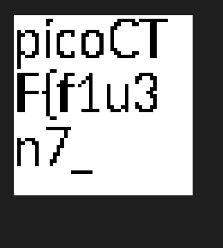

- The downloaded file is in pdf format, and this is the part of the flag you will find in
    - 1n_pn9_&_pdf_249d05c0}
- Then when we try to change the file extension to png, we will find the other part. 
    - 