- First I used MiniTool on windows to check if the data can be restored on the hard. 
- The Hard type is Manhattan model 130042
- I found 160 GB which can be restored, which contains various pdfs, images, files, and so on. 
- So I went to kali to use some forensics tools on it. 

### Handling the process from Kali
- First I needed to mount my E folder which contains enough space "!60 GB" on Kali using these steps: 
  1. Open Kali Settings
  2. open options
  3. select shared folders
  4. Add E
  5. Done
  6. and in the terminal:
     1. cd /mnt
     2. sudo mkdir hgfs
     3. sudo vmhgfs-fuse .host:/ /mnt/hgfs -o allow_other
     4. ls -> found E
     5. 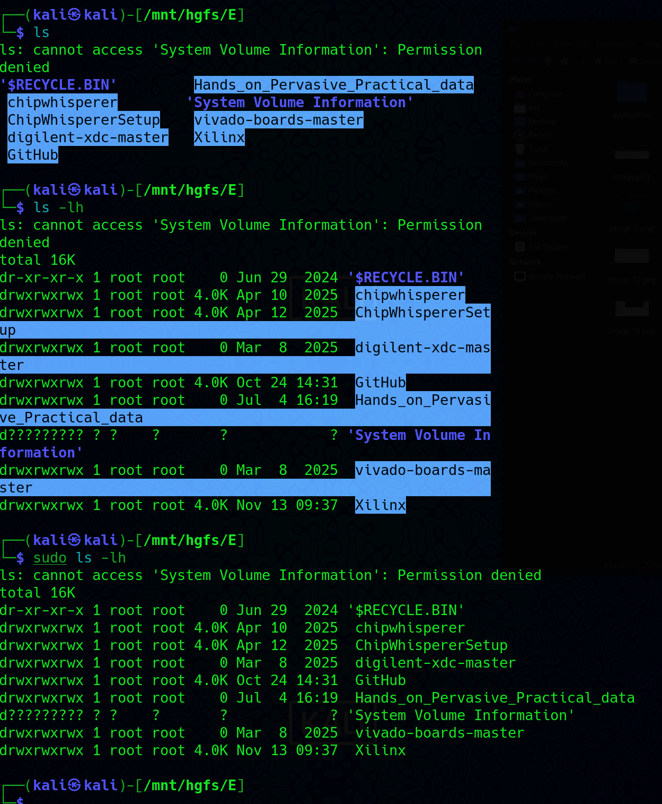
- Then I started creating raw forensic clone of the disk using this command: 
  - >  sudo ddrescue -f -n /dev/sdb hdd.img hdd.log
-  where: 
   -  hdd.img is a bit-by-bit image from all hard partitions.
   -  hdd.log is the log file which contains all locations of the readed partitions and if there are any errors. 
   -  -f -> force writing to the output file
   -  -n -> first pass only, no retries to copy only good partitions without trying to recover corrupted paritions.
-  The main idea of this, is to avoid making any corruptions on the real hard, so if I made any mistake, the data on the hard does not be affected.
-  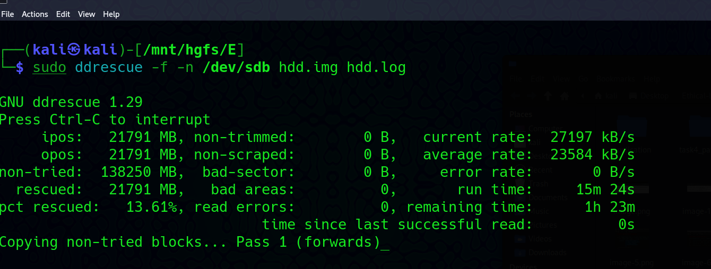

### TestDisk
- Now after we extracted the full image with no errors, I try to restore the original partitions with its original files and file names, using testDisk tool
  - > sudo testdisk hdd.img
- Then I need to select the hard disk
- Then it auto-detected the partition table type, which is EFI GPT. 
- Then we need to analyse the current partition structure 
  - 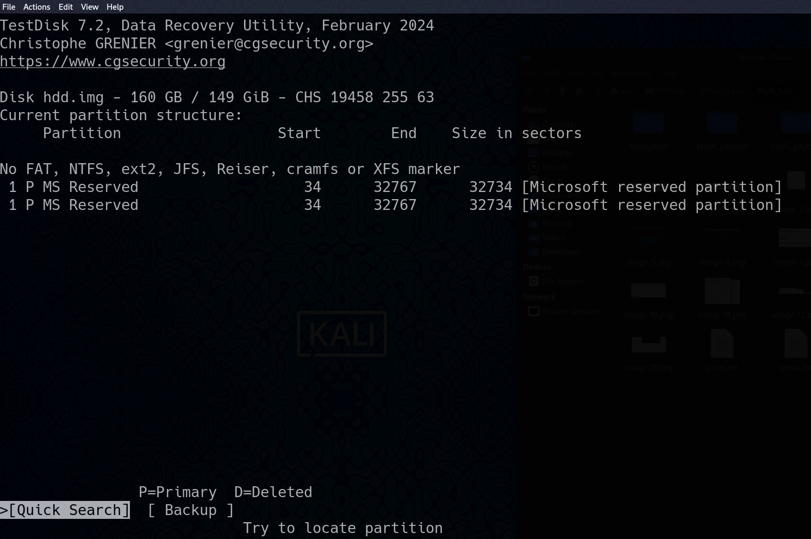
  - 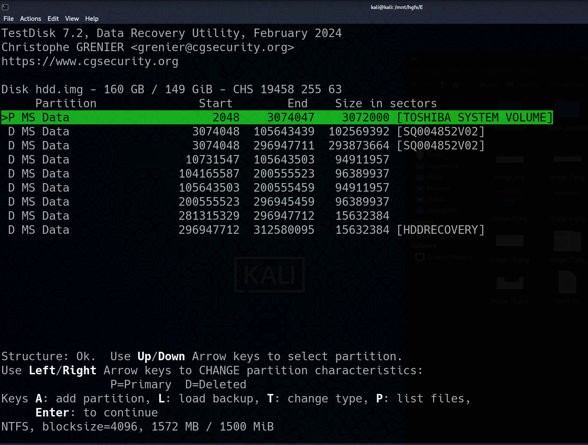
- TestDisk saying that the meta data has been deleted, and now we need to use another tool to recover the data. 
### PhotoRec (file carving)
- > sudo photorec hdd.img
  - 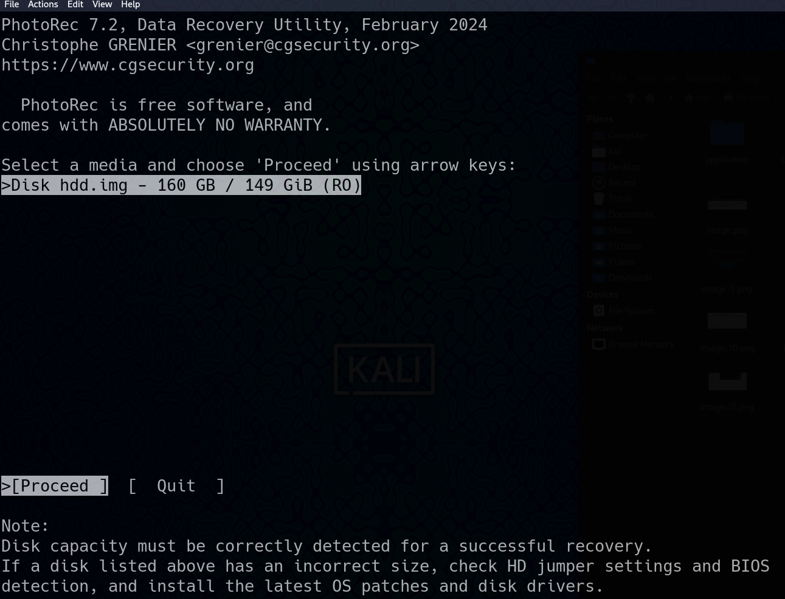
  - 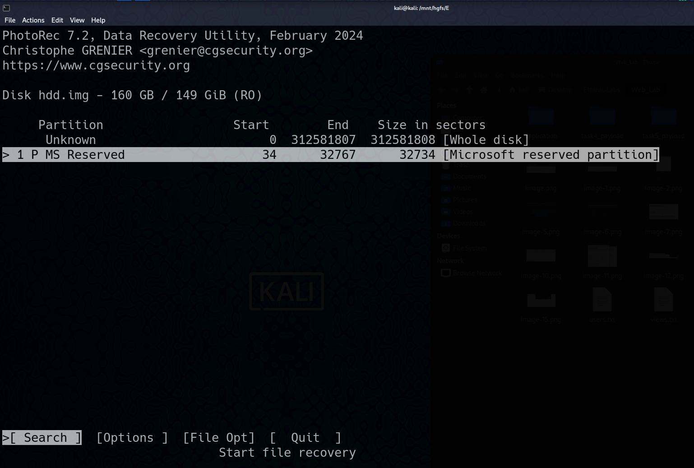
- Now we found one Unkown large partition which is the Whole disk
- Then We should select Other options ecause the Data was NTFS
- Then we should define destination file to upload the data to, so we should define a new empty folder for that.
- Then we should press C to start the recovery process.
  - 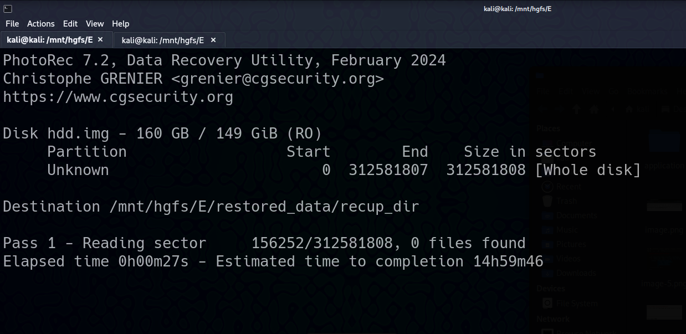
- Now we should just wait till the tool finish restoring the whole data :)

# Prevent Kali from Sleep: 
- sudo systemctl mask sleep.target suspend.target hibernate.target hybrid-sleep.target

- keep the screen always on: 
  - > xset s off -dpms

- we can return it back after photo rec finish, using this command: 
  - > sudo systemctl unmask sleep.target suspend.target hibernate.target hybrid-sleep.target


# After recovery
- I managed to restore 236k files
  - 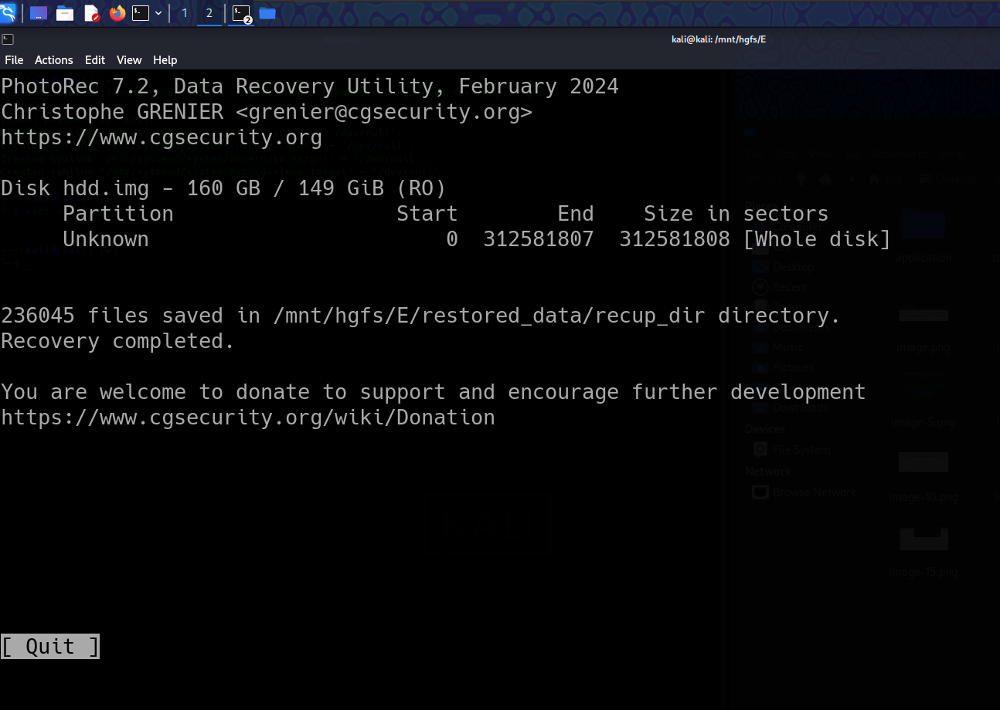
- But on viewing them on the file Explore, they are restored in different directories, and the file names are not all correctly restored. 
  - 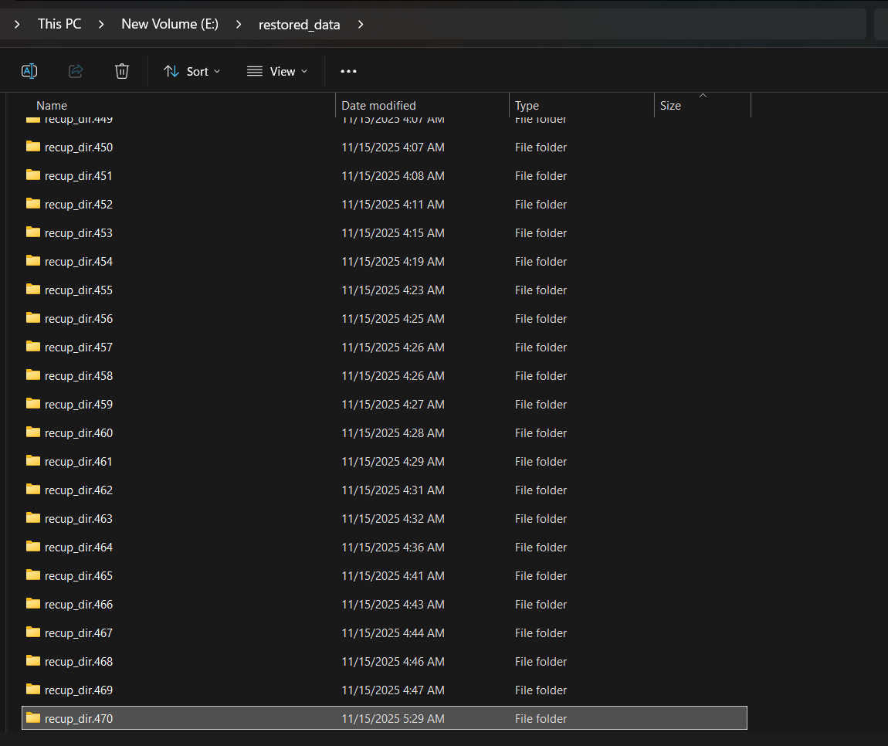
- So the plan now is to sort them in separate files. 
  - Imgs: png, jpg, gif
  - Pdfs, Word, excel, powerpoint
  - Videos
  - Sounds 
  - Others
    - 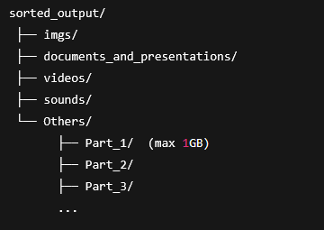
- Here is the python script I will use:

```python3 
# Author: Abdelaziz Neamatallah
# Date: 15.11.25
# Desc: Sorting recovered Files.
import os
import shutil
import time

# ============================
# CONFIGURATION
# ============================
SOURCE_DIR = r"E:\\restored_data"                  
DEST_DIR   = r"F:\\"                  

IMG_EXT      = {".jpg", ".jpeg", ".png", ".gif", ".bmp", ".tif", ".tiff", ".webp"}
DOC_EXT      = {".pdf", ".doc", ".docx", ".ppt", ".pptx", ".xls", ".xlsx"}
VIDEO_EXT    = {".mp4", ".mkv", ".avi", ".mov", ".flv", ".wmv"}
SOUND_EXT     = {".mp3", ".wav", ".aac", ".m4a", ".ogg"}
ZIPPED_EXT    = {".zip", ".rar", ".7z", ".tar", ".gz"}

MAX_OTHER_FOLDER_SIZE = 1 * 1024 * 1024 * 1024   # 1GB


# ============================
# HELPERS
# ============================

def ensure_folder(path):
    if not os.path.exists(path):
        os.makedirs(path)

def get_folder_size(path):
    total = 0
    for root, dirs, files in os.walk(path):
        for f in files:
            fp = os.path.join(root, f)
            try:
                total += os.path.getsize(fp)
            except:
                pass
    return total

def get_or_create_other_subfolder():
    others_base = os.path.join(DEST_DIR, "Others")
    ensure_folder(others_base)

    i = 1
    while True:
        candidate = os.path.join(others_base, f"Part_{i}")
        ensure_folder(candidate)
        if get_folder_size(candidate) < MAX_OTHER_FOLDER_SIZE:
            return candidate
        i += 1


# ============================
# MAIN SCRIPT
# ============================
now = time.time()
print("Starting file sorting...")

ensure_folder(DEST_DIR)

IMG_DIR    = os.path.join(DEST_DIR, "imgs")
DOC_DIR    = os.path.join(DEST_DIR, "documents_and_presentations")
VIDEO_DIR  = os.path.join(DEST_DIR, "videos")
SOUND_DIR  = os.path.join(DEST_DIR, "sounds")
ZIPPED_DIR = os.path.join(DEST_DIR, "zipped_files")

for d in [IMG_DIR, DOC_DIR, VIDEO_DIR, SOUND_DIR, ZIPPED_DIR]:
    ensure_folder(d)

# Loop through recup_dir folders
for folder in os.listdir(SOURCE_DIR):
    folder_path = os.path.join(SOURCE_DIR, folder)
    if not os.path.isdir(folder_path):
        continue

    print(f"[+] Scanning {folder}")

    for file in os.listdir(folder_path):
        file_path = os.path.join(folder_path, file)

        if not os.path.isfile(file_path):
            print(f'[-] Skipping non-file: {file_path}')
            continue

        ext = os.path.splitext(file)[1].lower()

        # IMAGE
        if ext in IMG_EXT:
            shutil.move(file_path, os.path.join(IMG_DIR, file))

        # DOCUMENT
        elif ext in DOC_EXT:
            shutil.move(file_path, os.path.join(DOC_DIR, file))

        # VIDEO
        elif ext in VIDEO_EXT:
            shutil.move(file_path, os.path.join(VIDEO_DIR, file))

        # SOUND
        elif ext in SOUND_EXT:
            shutil.move(file_path, os.path.join(SOUND_DIR, file))
        # ZIPPED
        elif ext in ZIPPED_EXT:
            shutil.move(file_path, os.path.join(ZIPPED_DIR, file))

        # OTHERS (1GB per subfolder)
        else:
            target_folder = get_or_create_other_subfolder()
            shutil.move(file_path, os.path.join(target_folder, file))
    print(f' time taken for this folder: {time.time() - now}')
    now = time.time()

print("\nDONE! All files sorted successfully.")


## Multithreaded version: 
import os
import shutil
import time
from concurrent.futures import ThreadPoolExecutor, as_completed
from threading import Lock

# ============================
# CONFIGURATION
# ============================
SOURCE_DIR = r"E:\\restored_data"
DEST_DIR   = r"F:\\"

IMG_EXT   = {".jpg", ".jpeg", ".png", ".gif", ".bmp", ".tif", ".tiff", ".webp"}
DOC_EXT   = {".pdf", ".doc", ".docx", ".ppt", ".pptx", ".xls", ".xlsx"}
VIDEO_EXT = {".mp4", ".mkv", ".avi", ".mov", ".flv", ".wmv"}
SOUND_EXT = {".mp3", ".wav", ".aac", ".m4a", ".ogg"}
ZIPPED_EXT = {".zip", ".rar", ".7z", ".tar", ".gz"}

MAX_OTHER_FOLDER_SIZE = 1 * 1024 * 1024 * 1024   # 1GB

# GLOBAL LOCK
other_lock = Lock()
folder_size_cache = {}


# ============================
# HELPERS
# ============================
def ensure_folder(path):
    if not os.path.exists(path):
        os.makedirs(path, exist_ok=True)

def get_folder_size(path):
    total = 0
    for root, dirs, files in os.walk(path):
        for f in files:
            try:
                total += os.path.getsize(os.path.join(root, f))
            except:
                pass
    return total


def get_or_create_other_subfolder():
    """
    Ensure we safely pick a Part_N folder without race conditions.
    """
    with other_lock:
        base = os.path.join(DEST_DIR, "Others")
        ensure_folder(base)

        i = 1
        while True:
            folder = os.path.join(base, f"Part_{i}")
            ensure_folder(folder)

            if folder not in folder_size_cache:
                folder_size_cache[folder] = get_folder_size(folder)

            if folder_size_cache[folder] < MAX_OTHER_FOLDER_SIZE:
                return folder

            i += 1


# ============================
# WORKER FUNCTION
# ============================
def process_file(file_path):
    ext = os.path.splitext(file_path)[1].lower()
    file = os.path.basename(file_path)

    # Destination folders
    if ext in IMG_EXT:
        target = IMG_DIR
    elif ext in DOC_EXT:
        target = DOC_DIR
    elif ext in VIDEO_EXT:
        target = VIDEO_DIR
    elif ext in SOUND_EXT:
        target = SOUND_DIR
    elif ext in ZIPPED_EXT:
        target = ZIPPED_DIR
    else:
        target = get_or_create_other_subfolder()

    try:
        shutil.move(file_path, os.path.join(target, file))

        # Update folder size cache
        if "Others" in target:
            with other_lock:
                folder_size_cache[target] += os.path.getsize(os.path.join(target, file))
    except Exception as e:
        print(f"Error moving {file_path}: {e}")


# ============================
# MAIN SCRIPT
# ============================
start = time.time()

# Ensure base folders
IMG_DIR   = os.path.join(DEST_DIR, "imgs")
DOC_DIR   = os.path.join(DEST_DIR, "documents_and_presentations")
VIDEO_DIR = os.path.join(DEST_DIR, "videos")
SOUND_DIR = os.path.join(DEST_DIR, "sounds")
ZIPPED_DIR = os.path.join(DEST_DIR, "zipped_files")

for d in [IMG_DIR, DOC_DIR, VIDEO_DIR, SOUND_DIR, ZIPPED_DIR]:
    ensure_folder(d)

print("Starting parallel sorting...")

file_tasks = []

# Collect all files first
for folder in os.listdir(SOURCE_DIR):
    folder_path = os.path.join(SOURCE_DIR, folder)
    if not os.path.isdir(folder_path):
        continue

    for file in os.listdir(folder_path):
        file_path = os.path.join(folder_path, file)
        if os.path.isfile(file_path):
            file_tasks.append(file_path)

print(f"Total files: {len(file_tasks)}")

# PROCESS WITH THREADPOOL
with ThreadPoolExecutor(max_workers=16) as executor:
    futures = [executor.submit(process_file, f) for f in file_tasks]

    for fut in as_completed(futures):
        pass

print("DONE! Time:", time.time() - start, "seconds")


```

# The harddisk is not shown in windows 11
- Despite I connected the hard to windows 11 and it is been read.
    - 
- However, I can not see it.
    - 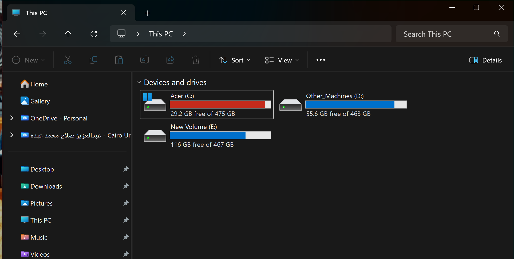
- And this sometimes happens when the hard is old, and OS see it as Raw and not initialized
- So the solution is to open the Disk Management:
  - > Win + X
  - Then select Disk management
    - 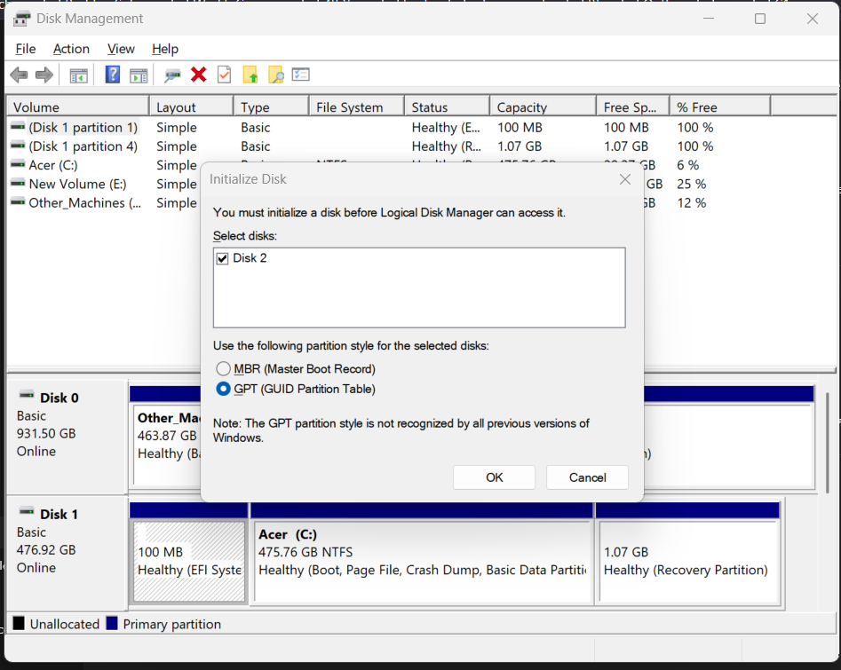
  - I did not find the required disk.
- So I opened Device Manager to ensure that the disk is seen by the device
  - 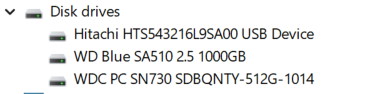
  - It is the Hitachi USB Device
- So I opened cmd
    - > diskpart
    - list disk
  - I found that it is the disk 2
    - 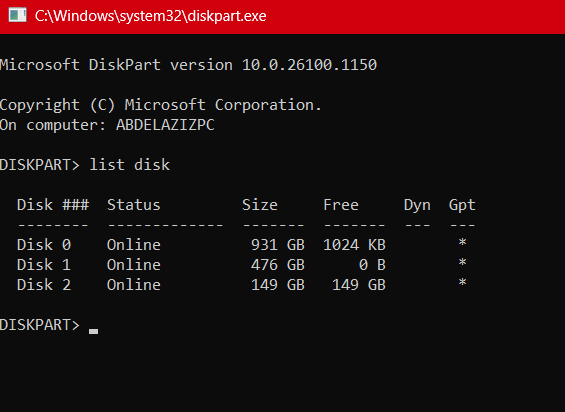
    - > select disk 2
    - clean
  - now I will create new partition and NTFS format
    - create partition primary
    - format fs=ntfs quick
    - assign
  - Now I can see it in my PC
    - 

# Now Starting the copy process
- Now I should just create the folders in the hard, and start copying the data
  - > python recoverData.py
# Final Results
- Counting number of files found 
  - 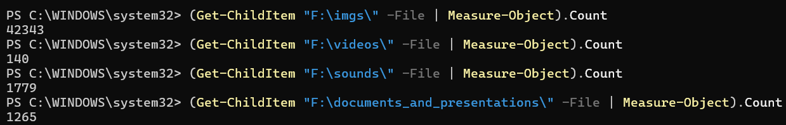